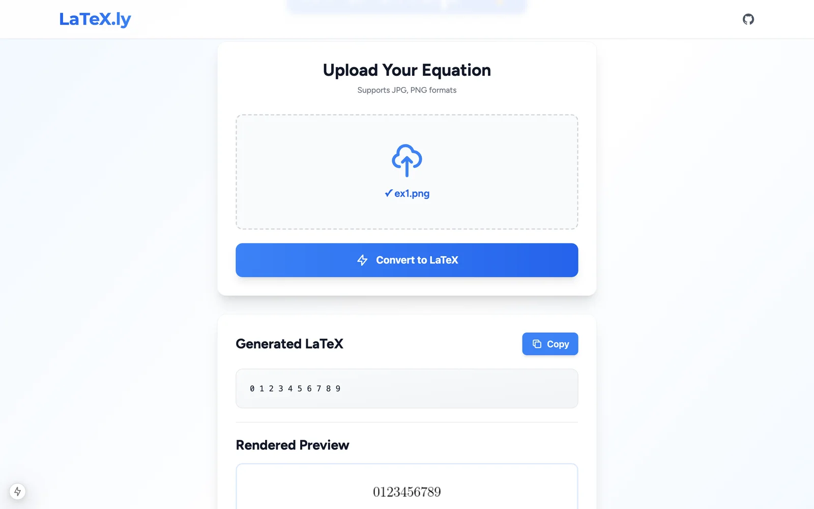
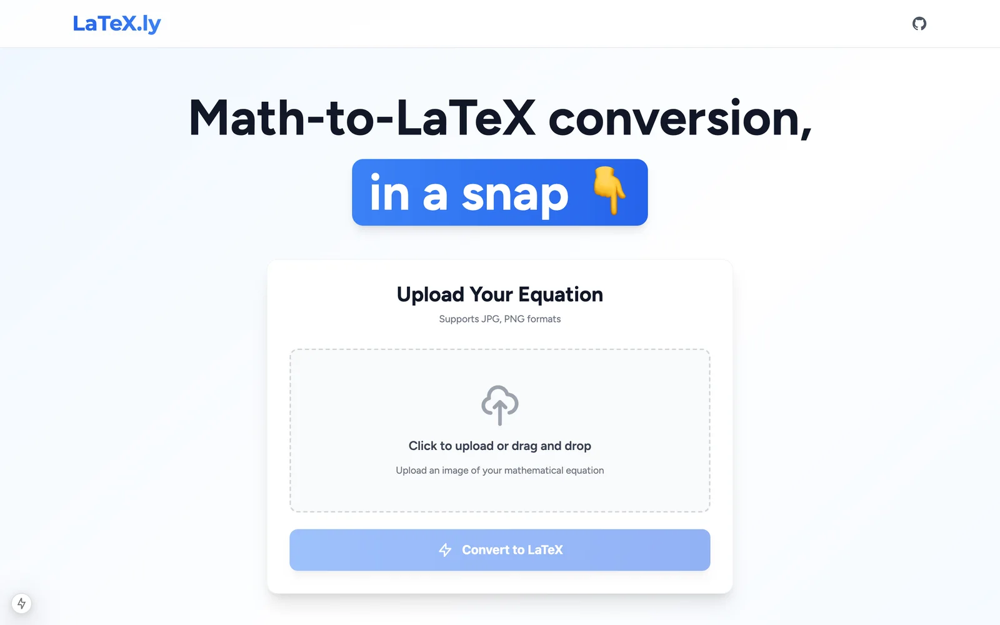
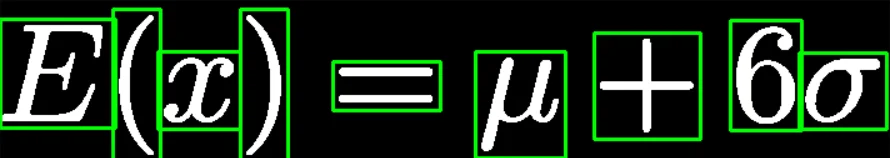

# LaTeX.ly

Take a photo of a math equation, handwritten or printed, and get the LaTeX for it.



## Features

- Upload an image of an equation and get LaTeX back with a rendered preview
- Works on handwriting and printed math
- The symbol classifier is a CNN I trained from scratch on 49k+ images
- Conversion history, with your last 30 conversions saved in the browser so you can reopen, copy or delete them
- Flask REST API with a Next.js front end

## Screenshots

| Upload | Contour detection per symbol |
| :-: | :-: |
|  |  |

## How it works

1. OpenCV cleans up the image and finds the contour around each symbol. Symbols that split into pieces, like = and i, get merged back together.
2. Each symbol is cropped, resized to 64×64 and classified by the PyTorch CNN.
3. The predictions are read left to right and put together into a LaTeX string.

I trained five versions of the model on 49k+ symbol images, 24k that I generated across 25 fonts and 25k handwritten ones from CROHME.

## Stack

Python, PyTorch, OpenCV, NumPy, Flask, Next.js, React, Tailwind, Docker.

## Running locally

The easiest way is Docker. This starts the API on port 5000 and the app on [localhost:3000](http://localhost:3000):

```sh
docker compose up --build
```

If port 5000 is taken (on a Mac it's usually AirPlay Receiver), use `API_PORT=5001 docker compose up --build`. `WEB_PORT` changes the app's port the same way. Keep `--build` when you change `API_PORT`, since the API URL gets baked into the front end.

To run it without Docker you'll need Python 3.9+ and Node 18.18+. Start the API (port 5000):

```sh
cd backend
pip install -r requirements.txt
python read.py
```

Then the front end:

```sh
cd frontend
npm install
npm run dev
```

If you want to train the model yourself, also install `requirements_train.txt` and open `backend/train.ipynb`.

## What I learned

### Having a good dataset is important

- To build it, I
  - Created **1.6k original images** of 64 math symbols in 25 different fonts using Matplotlib
  - Applied minor transformations, creating **24k+ augmented images**
  - Sourced **25k handwritten math symbols** from CROHME
- Ultimately, I ended up with **49k+ unique images of math symbols**
- Throughout the process, I had to consistently find and create more data, without overfitting


Almost 50k images!

### Preprocessing data is key

- Data, especially handwritten math symbols, contain many inconsistencies
- With a convolutional neural network trained on consistent data, it is necessary to process data before usage
- For instance, my algorithm applies a Gaussian blur, adaptive thresholding, and a denoising filter amongst other things
- Without preprocessing data, the model's accuracy significantly decreases


### How neural networks work

- With this project, I got to work with and understand how CNNs take in data and output results
- I learned:
  - How to structure a neural network for OCR tasks, balancing the number of layers and neurons for training
  - The importance of choosing the right activation functions (i.e. ReLU improved symbol detection, while softmax was useful for classification)
  - How to use SGD with mini-batches for efficiency and Cross Entropy Loss to improve accuracy

### It's okay to start over

- I originally started this project in November, deciding to use Tesseract, a pre-built open source OCR model
- However, the model was trained only on English letters, making math symbol recognition impossible
- After trying to train my own Tesseract model, the mix of its dataset and mine was not effective either
- I then experimented with TensorFlow and PyTorch, ultimately choosing the latter for its simplicity
- Having restarted my project, I spent many hours cultivating a dataset, which I then used to train my model
- But in my first four attempts, my model had surprisingly low accuracy
  - In the CROHME dataset, there were many inaccurate symbols
  - After slowly cleaning my dataset, 5 models later, I had created one that was **90%+ more accurate than Tesseract**
- Approaching and learning something new is scary. But I learned not to be afraid to restart, if it means getting on the right track
